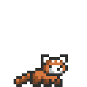
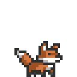
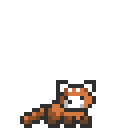

<h1 align="center">Chadi Boudaher</h1>

  <strong>Computer Engineer · Machine Learning · Computer Vision</strong>

  <em>From video frames to language, through the math and engineering in between.</em>

  <a href="https://www.linkedin.com/in/chadiboudaher1/">LinkedIn</a>
  &nbsp;·&nbsp;
  <a href="mailto:chadiboudaher7@gmail.com">Email</a>
  &nbsp;·&nbsp;
  <a href="https://github.com/chadiboudaher?tab=repositories">Projects</a>

  <strong>Hi, I'm Chadi.</strong> I'm a master's student in
  <strong>Computer and Communications Engineering</strong> working at the
  intersection of <strong>machine learning research, computer vision, speech,
  and engineering</strong>. Outside the thesis, I build ML experiments,
  computer vision systems, and backend infrastructure using
  <strong>PyTorch, OpenCV, FastAPI, and PostgreSQL</strong>.

 

<h3>What I'm working on</h3>

<strong>Lebanese Arabic Visual Speech Recognition</strong>

Studying lip reading and audiovisual speech, including the challenges of dialect, code-switching, and limited data availability.

<strong>Audio-Visual Corpus Builder</strong>

Building a research pipeline for video processing, face detection, speech segmentation, active-speaker evidence, human review, and versioned dataset exports.

<strong>Hands-on ML Experiments</strong>

Implementing models, comparing results, and exploring why systems work — not just what score they achieve.
 

<h3>Selected work</h3>

<strong><a href="https://github.com/chadiboudaher/10000-hours-ml">10,000 Hours of ML</a></strong>

A public home for deliberate practice, implementations, experiments, and research notes across machine learning and deep learning.

<strong>ML & Deep Learning with PyTorch</strong>

Model implementations and practical experiments covering neural networks, computer vision, sequence models, and classical machine learning.

<strong>Audio-Visual Corpus Builder</strong>

A pipeline for collecting and processing audiovisual data for Lebanese Arabic visual speech recognition.
 

<h3>Tools I reach for</h3>

<strong>ML / AI</strong> — Python · PyTorch · scikit-learn

<strong>Vision & Media</strong> — OpenCV · FFmpeg

<strong>Data</strong> — NumPy · pandas · Matplotlib

<strong>Backend</strong> — FastAPI · PostgreSQL

<strong>Engineering</strong> — Docker · Git · Linux
 

<h3>What I'm exploring</h3>

Visual speech recognition · Multimodal learning · Computer vision · Sequence models · Low-resource speech technology · Deep learning systems
 

  
  &nbsp;&nbsp;&nbsp;
  

  <strong>Still learning. Still building.</strong>

  Interested in machine learning research, computer vision, and systems for low-resource speech technology.

  <a href="mailto:chadiboudaher7@gmail.com">Let's connect</a>

