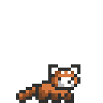
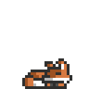
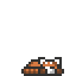

<h1 align="center">Chadi Boudaher</h1>

  <strong>Computer Engineer · Machine Learning · Computer Vision</strong>

  <strong>Hi, I'm Chadi.</strong> I'm a master's student in
  <strong>Computer and Communications Engineering</strong> working at the
  intersection of <strong>machine learning research, computer vision, speech,
  and engineering</strong>. Outside the thesis, I build ML experiments,
  computer vision systems, and backend infrastructure using
  <strong>PyTorch, OpenCV, FastAPI, and PostgreSQL</strong>.

 

Tools I reach for

  
  
  
  
  

  
  
  
  

  
  
  

 

PyTorch appreciation corner

Most of my learning happens by building the model myself, breaking something, checking tensor shapes, fixing it, and trying again.
PyTorch is usually where that happens.
 

Selected work
10,000 Hours of ML
A public home for deliberate practice, implementations, experiments, and research notes across machine learning and deep learning.

Audio-Visual Corpus Builder
A pipeline for collecting and processing audiovisual data for Lebanese Arabic visual speech recognition — including video processing, speech segmentation, face analysis, active-speaker evidence, review, and dataset export.

ML Media Orchestrator
A backend system for asynchronous media-processing jobs built around FastAPI, PostgreSQL, task processing, and production-style backend concepts.
 

What I'm working on
Lebanese Arabic Visual Speech Recognition
Studying lip reading and audiovisual speech in a low-resource setting, with a focus on dialect, code-switching, speaker diversity, and dataset quality.

Building the dataset before trusting the model
Developing an audiovisual corpus pipeline because high-quality Lebanese Arabic training data is itself a major part of the research problem.

Hands-on ML experiments
Implementing models, reproducing ideas from papers, comparing results, and trying to understand why a model succeeds or fails instead of stopping at the final metric.
 

  
  &nbsp;&nbsp;&nbsp;&nbsp;
  

<h3 align="center">Come say hi</h3>

  
  
  

  Still learning. Still building.

