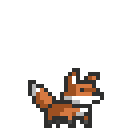
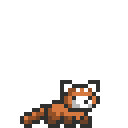
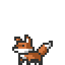
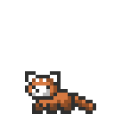
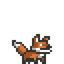

<h1 align="center">Chadi Boudaher</h1>

  

**Hi, I'm Chadi 👋**

I'm a master's student in **Computer and Communications Engineering** working at the intersection of **machine learning research, computer vision, and speech**. My thesis is on **lip reading for Lebanese Arabic**, a low-resource dialect with heavy code-switching.

Outside the thesis I build ML experiments, computer vision systems, and backend infrastructure with **PyTorch, OpenCV, FastAPI, and PostgreSQL**.

 

  
  &nbsp;&nbsp;
  
  
  &nbsp;&nbsp;
  

---

## 🔭 What I'm working on

| | |
|---|---|
| 🗣️ **Lebanese Arabic VSR** | Lip reading and audiovisual speech in a low-resource dialect: code-switching, speaker diversity, and few existing datasets. |
| 🧱 **Dataset first, model second** | Face processing, speech segmentation, active-speaker evidence, human review, and versioned dataset exports. |
| 🧪 **Hands-on ML** | Re-implementing models and papers, comparing results, and figuring out *why* systems succeed or fail. |

---

## 🚀 Selected work

| Project | What it is | Stack |
|---|---|---|
| **[10,000 Hours of ML](https://github.com/chadiboudaher?tab=repositories)** | Deliberate ML practice: implementations, experiments, and research notes. | `PyTorch` `NumPy` `scikit-learn` |
| **[Audio-Visual Corpus Builder](https://github.com/chadiboudaher?tab=repositories)** | Research pipeline for collecting and processing Lebanese Arabic audiovisual data for visual speech recognition. | `OpenCV` `FFmpeg` `Python` |
| **[ML Media Orchestrator](https://github.com/chadiboudaher?tab=repositories)** | FastAPI backend for asynchronous media-processing jobs, with production-style backend practices. | `FastAPI` `PostgreSQL` `Docker` |

> 🔗 Swap each link above for the direct repo URL.

---

## 🛠️ Toolbox

  <b>ML &amp; Vision</b> 
  
  
  
  
  
  

  <b>Backend &amp; Infra</b> 
  
  
  
  
  
  

  

  
  &nbsp;&nbsp;&nbsp;🔥&nbsp;&nbsp;&nbsp;
  

  <i>Build the model. Break something. Check the tensor shapes. 
  Fix it. Try again.</i>

  

  

---

## 📊 GitHub activity

  
  

---

<h3 align="center">Come say hi</h3>

  
  
  

  
  &nbsp;&nbsp;
  

