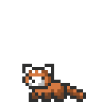

<h1 align="center">Chadi Boudaher</h1>

  <strong>Computer Engineer · Machine Learning · Computer Vision</strong>

  <strong>Hi, I'm Chadi.</strong> I'm a master's student in
  <strong>Computer and Communications Engineering</strong> working at the
  intersection of <strong>machine learning research, computer vision, speech,
  and engineering</strong>. Outside the thesis, I build ML experiments,
  computer vision systems, and backend infrastructure using
  <strong>PyTorch, OpenCV, FastAPI, and PostgreSQL</strong>.

 

  
  &nbsp;&nbsp;
  Computer Engineer · Machine Learning · Computer Vision
  &nbsp;&nbsp;
  

  
  &nbsp;━━━━━━━━━━━━━━━━━━━━━━━━━━━━━━━━━━━━&nbsp;

Tools

  
  
  
  

  
  
  
  

  
  
  
  

<table>
  <tr>
    <td width="95" align="center" valign="middle">
      
    </td>
    <td align="center" valign="middle">
      <h3>PyTorch appreciation corner</h3>
      
        
      Most of my learning happens by building the model myself,
      breaking something, checking tensor shapes, fixing it, and trying again.
        
      <strong>PyTorch is usually where that happens.</strong>
    </td>
    <td width="95" align="center" valign="middle">
      
    </td>
  </tr>
</table>

  &nbsp;━━━━━━━━━━━━━━━━━━━━━━━━━━━━━━━━━━━━&nbsp;
  

Selected work
- 10,000 Hours of ML — deliberate ML practice, implementations, experiments, and research notes.
- Audio-Visual Corpus Builder — a research pipeline for collecting and processing Lebanese Arabic audiovisual data for visual speech recognition.
- ML Media Orchestrator — a FastAPI backend for asynchronous media-processing jobs with PostgreSQL, Docker, and production-style backend concepts.

What I'm working on
- Lebanese Arabic Visual Speech Recognition — lip reading and audiovisual speech in a low-resource dialect, including code-switching and speaker diversity.
- Building the dataset before trusting the model — face processing, speech segmentation, active-speaker evidence, human review, and versioned dataset exports.
- Hands-on ML experiments — implementing models, reproducing ideas from papers, comparing results, and understanding why systems succeed or fail.

  
  &nbsp;&nbsp;
  
  &nbsp;&nbsp;&nbsp;&nbsp;
  
  &nbsp;&nbsp;
  

  
  

<h3 align="center">Come say hi</h3>

  
  
  

