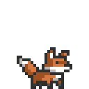
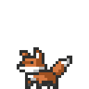
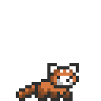
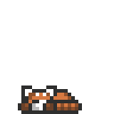

<h1 align="center">Chadi Boudaher</h1>

  

**Hi, I'm Chadi.**

I'm a master's student in **Computer and Communications Engineering** working at the intersection of **machine learning research, computer vision, and speech**.

My thesis focuses on **visual speech recognition for Lebanese Arabic**, a low-resource setting shaped by limited audiovisual data, dialect variation, and code-switching.

Outside the thesis, I build ML experiments, computer vision systems, and backend infrastructure.

 

  
  &nbsp;&nbsp;
  
  
  
  
  &nbsp;&nbsp;
  

---

<h2 align="center">Tools</h2>

<h4 align="center">Languages</h4>

  
  
  
  
  

<h4 align="center">Machine Learning & Vision</h4>

  
  
  
  
  
  
  
  

<h4 align="center">Web & Backend</h4>

  
  
  
  
  

<h4 align="center">Systems & Dev Tools</h4>

  
  
  
  

 

  
  
  &nbsp;&nbsp;&nbsp;
  
  &nbsp;&nbsp;&nbsp;
  
  

  

  
  &nbsp;&nbsp;
  
  &nbsp;&nbsp;
  

  <em>
    Build the model. Break something. Check the tensor shapes. 
    Fix it. Try again.
  </em>

  

 

---

<h2 align="center">Selected work</h2>

<table width="100%">
  <!-- 1: gif LEFT, text RIGHT -->
  <tr>
    <td width="50%" align="center" valign="middle">
      
    </td>
    <td width="50%" align="left" valign="middle">
      <h3><a href="https://github.com/chadiboudaher/10000-hours-ml">10,000 Hours of ML</a></h3>
      

        Deliberate machine-learning practice through <b>implementations, experiments, paper-inspired ideas, and model analysis</b>.
      

    </td>
  </tr>

  <!-- 2: text LEFT, gif RIGHT -->
  <tr>
    <td width="50%" align="left" valign="middle">
      <h3><a href="https://github.com/chadiboudaher/av-leb-corpus-builder">Audio-Visual Corpus Builder</a></h3>
      

        A research pipeline for building a <b>Lebanese Arabic audiovisual corpus</b> from long-form video, with speech segmentation, face processing, active-speaker evidence, review, and versioned exports.
      

    </td>
    <td width="50%" align="center" valign="middle">
      
    </td>
  </tr>

  <!-- 3: gif LEFT, text RIGHT -->
  <tr>
    <td width="50%" align="center" valign="middle">
      
    </td>
    <td width="50%" align="left" valign="middle">
      <h3><a href="https://github.com/chadiboudaher/ml-media-orchestrator">ML Media Orchestrator</a></h3>
      

        A backend for <b>asynchronous media-processing jobs</b>, designed around production backend concepts rather than a simple CRUD API.
      

    </td>
  </tr>
</table>

 

---

  

<!-- foxes walking toward each other, meeting in the middle -->
<table align="center">
  <tr>
    <td align="center" width="260">
      
        
      
       
      Let's connect
    </td>
    <td align="center" width="260">
      
        
      
       
      Drop me a line
    </td>
    <td align="center" width="260">
      
        
      
       
      Browse the code
    </td>
  </tr>
</table>

 

  Always up for a chat about

  
  
  
  
  
  

 

  
  &nbsp;&nbsp;&nbsp;
  

  Thanks for stopping by. The foxes are asleep, the models are training.

  

